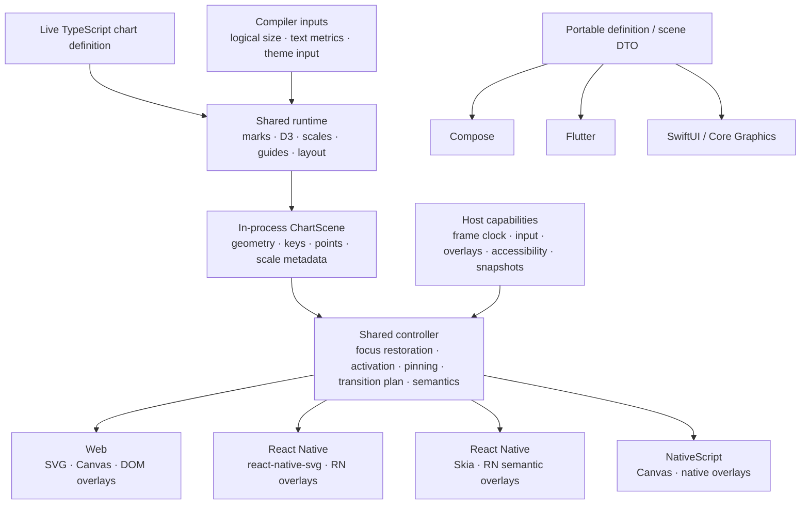

# Native platform support spike

Research date: 2026-07-30

## Decision

Full React Native support is feasible without replacing the chart grammar or
the D3-based compiler. It is not an adapter-only project. The reusable unit is
the keyed `ChartScene`; sizing, text, paint resolution, rendering, gestures,
tooltips, animation, accessibility, and raster export need native
implementations.

Build in this order:

1. Keep the compiler and existing focus algorithms DOM-free, extract the
   browser-owned interaction state, and introduce a renderer-neutral
   transition plan.
2. Ship `react-native-svg` as the default React Native renderer.
3. Add React Native Skia as an optional renderer for dense or frequently
   updated charts, after measuring the crossover.
4. Use the same core refactor to test a NativeScript Core view backed by
   `@nativescript/canvas`.
5. Treat Compose, SwiftUI, and Flutter as separate native products consuming a
   portable definition or scene schema. They cannot share the live TypeScript
   API.

React Native is the highest-confidence target because its JavaScript runtime
can execute the existing definitions, accessors, imported D3 modules, scales,
and scene compiler. NativeScript is expected to reuse those layers, subject to
a bundler and runtime proof. Kotlin, Swift, and Dart cannot preserve arbitrary
JavaScript callbacks without embedding a JavaScript runtime.

## What “everything” should mean

Parity should be measured by outcome, not by reproducing browser mechanics.

| Contract               | Native parity                                                                                                                                                                |
| ---------------------- | ---------------------------------------------------------------------------------------------------------------------------------------------------------------------------- |
| Data-to-scene behavior | The same definition and data produce equal normalized domains, mark keys, topology, and focus order; numeric geometry and runtime-formatted labels meet explicit tolerances. |
| Visual behavior        | Every current scene primitive, mark family, coordinate system, guide, legend, gradient, and clip renders within documented tolerances.                                       |
| Interaction behavior   | Library-owned focus, grouped focus, activation, and pinning match. App-owned brush, zoom, scrub, range selection, and editing use documented native integration patterns.    |
| Motion behavior        | Stable-key enter/update/exit, interruption, reduced motion, and incompatible-path fallback retain the same semantics.                                                        |
| Accessibility behavior | A user can discover the chart, traverse or adjust the current datum, hear values, activate selections, and reach an application-provided complete data representation.       |
| Export behavior        | JavaScript targets retain deterministic resource-aware SVG. Native renderers add platform bitmap snapshots and file/share integration.                                       |
| Web-only behavior      | SSR, hydration, DOM callbacks, CSS selectors, and mouse-specific input remain supported by the web renderer; they are not native device requirements.                        |

Pixel-identical text across browser engines, Core Text, Android text, and Skia
is not a useful acceptance criterion. Geometry can be exact when renderers
consume the same scene; independently ported compilers need numeric tolerances
for geometry too.

## Current repository boundary

The repository already has most of the right compiler boundary:

- `createChartRuntime` and `createChartScene` take definitions and logical
  dimensions and produce a scene.
- Marks emit seven portable node types: group, rule, polyline, area, dot,
  rectangle, and label.
- Cartesian, facet, polar, and geographic marks all end at those primitives.
  Polar and geographic shapes carry path strings instead of requiring a DOM.
- Focusable `ChartPoint` records are separate from painted nodes. This permits
  renderer batching without losing datum identity or hit testing.
- Resource-aware static SVG serialization through
  `renderChartSvgWithResources` is already independent of a mounted browser
  surface. The lower-level `renderChartSvg` does not emit gradient and clip
  resources by itself.
- The conformance corpus contains 100 cases, including 16 executable
  interaction cases and 51 interaction scenarios. It supplies coverage, but
  many cases combine definition, DOM mount, controls, selectors, and
  DOM-specific gesture code. Native conformance first requires extracting
  platform-neutral data and definition factories, then replacing mounts,
  application controllers, and drivers.

The public renderer and host boundary is browser-shaped:

| Evidence                                                                                                                                       | Native consequence                                                                                                               |
| ---------------------------------------------------------------------------------------------------------------------------------------------- | -------------------------------------------------------------------------------------------------------------------------------- |
| `ChartSurface.element` is `Element`; `ChartRenderer.mount` accepts `HTMLElement`; render callbacks expose `HTMLElement` and `SVGSVGElement`.   | A native renderer cannot implement the current public contract honestly.                                                         |
| `renderer.ts` owns `ResizeObserver`, pointer and keyboard events, animation frames, DOM tooltips, focus, and reduced-motion queries.           | Reusable interaction state is mixed with browser services.                                                                       |
| `canvas.ts` creates HTML canvases and reads `devicePixelRatio` and media queries.                                                              | Its painter can be extracted, but the current Canvas renderer cannot run in NativeScript or React Native.                        |
| `dom-text.ts` reads computed CSS and measures through browser Canvas 2D.                                                                       | Native layout needs a different font-resolution and measurement service.                                                         |
| `RendererChart.tsx` imports `react-dom`, mounts `<div>` elements, injects HTML, and portals tooltips into DOM elements.                        | The React adapter is a web adapter, not a portable React component.                                                              |
| Default theme colors use `currentColor` and CSS custom properties.                                                                             | Native renderers need concrete colors or platform-resolved semantic tokens.                                                      |
| Gradient references are emitted as SVG/CSS `url(#id)` strings; scene nodes also carry `className` and `ariaHidden`.                            | Structured paint references and semantic metadata should be separated from web serialization.                                    |
| `SceneLabel` and `ChartTextMeasureOptions` expose size and weight, but not family, style, stretch, direction, letter spacing, or locale.       | Native guide layout cannot reproduce the font that will paint the label.                                                         |
| `ResolvedScale.map` is a function and `ChartPoint.datum` can contain any live value.                                                           | The in-process scene is portable between JavaScript renderers, but is not a language-neutral serialized schema.                  |
| The root remains browser-inclusive; `@tanstack/charts/universal` and `@tanstack/charts/types` select the DOM-free value and declaration graph. | Native code has a supported boundary, while strict dependency checking still exposes the upstream `ImageData` declaration issue. |

Directional code inventory:

- The browser-heavy renderer, Canvas host, DOM export, DOM text measurement,
  and reconciliation files remain a substantial but isolated implementation
  layer.
- Most mark, scale, layout, polar, geographic, and scene construction code is
  renderer-independent.

Source counts change too quickly to serve as a credible reuse guarantee.
`types.ts` is now DOM-free, while `renderer.ts` and `canvas.ts` still mix
portable behavior with browser services. The React web adapter remains a
rewrite target because its UI is HTML plus `react-dom`.

## Required architecture



Use narrow capabilities, not DOM-shaped polyfills.

Compiler inputs:

- `measureText(request)`: resolved font properties in; advance width and line
  metrics out, with optional ink bounds.
- `resolvePaint(token)`: semantic or CSS-like theme input to renderer-usable
  paint.
- `layoutSize`: logical dimensions supplied by the host.

Host, controller, and surface capabilities:

- `requestFrame`, `cancelFrame`, and reduced-motion state.
- Platform coordinates to logical scene coordinates.
- Tooltip and application-owned overlay presentation.
- Focus-indicator geometry, style, visibility, and paint.
- Accessible summary, active-datum controls, actions, and announcements.
- Optional renderer-specific bitmap snapshots.

The compiler must remain a normal JavaScript operation. React Native worklets
should only own frame-critical numeric state, such as gesture coordinates,
crosshair position, preview transforms, paint interpolation, and a
worklet-safe nearest-point index. Arbitrary accessors, D3 modules, tooltip
formatters, and custom marks should not be serialized into the UI runtime.
[Reanimated worklets](https://docs.swmansion.com/react-native-reanimated/docs/guides/worklets/)
are a separate JavaScript context with serialization constraints.

### Two scene contracts

Do not freeze the current `ChartScene` as a cross-language wire format.

1. **In-process scene:** retains live data references, scale mapping functions,
   extension objects, and efficient indexes. React Native and NativeScript can
   consume this directly.
2. **Portable scene DTO:** versioned JSON-compatible geometry, resolved paints,
   scale metadata, datum IDs, semantic descriptions, and interaction policies.
   Compose, SwiftUI, and Flutter can consume this, but live callbacks stay in
   their host language.

The proposed [`PORTABLE-CHART-SPEC.md`](./PORTABLE-CHART-SPEC.md) registry
model is the right definition-level companion. `$call` and `$data` can describe
a supported portable subset. It should never claim to serialize arbitrary
JavaScript accessors, custom tooltip components, or renderer plugins.

### Core refactor

1. Keep the completed universal/DOM declaration split. Further separate shared
   renderer, focus, semantic, and transition contracts from browser host
   implementations.
2. Keep the existing focus strategies, grouping, and spatial contracts. Move
   focus restoration/order, pinned state, host input orchestration, default
   tooltip content, and render-reason policy out of `renderer.ts` into a
   renderer-neutral controller.
3. Introduce keyed scene diffing, interpolation instructions, and interruption
   state as a transition planner. Current SVG motion is DOM attribute
   reconciliation; current Canvas motion is a whole-frame crossfade.
4. Extract the Canvas 2D painter behind a structural drawing-context
   interface. Keep HTML canvas creation, pixel ratio, media queries, and export
   in the web host.
5. Resolve theme colors before painting. Keep CSS variables and
   `currentColor` as web-adapter inputs, not scene paints.
6. Expand typography to include family, size, weight, style, stretch, letter
   spacing, direction, locale, and font-scale policy. Measurement cache keys
   must include all of them.
7. Preserve the resolved F-106 ownership rule: dynamic builders receive the
   default theme; application and platform overrides enter through typed
   inputs or the returned definition and merge during scene creation. Do not
   pass a builder the theme that it is itself responsible for returning.
8. Keep deterministic, resource-aware SVG serialization in the shared
   JavaScript package.
9. Define capability fallbacks for unsupported paint, path, filter, snapshot,
   and semantic features.
10. Give gradients and other resources structured scene references; serialize
    `url(#id)` only in the SVG renderer.
11. Treat typography and structured paints as public API migrations. Add
    backward-compatible unions and normalization first, or version the change;
    update migration docs and conformance before removing string paints or
    existing text-measure options.

This can remain additive for web consumers: add new internal contracts and
make the DOM host implement them. The browser-oriented root remains compatible;
cross-runtime consumers opt into `@tanstack/charts/universal` and
`@tanstack/charts/types`.

## React Native

As of this research, React Native 0.86 is current stable. React Native 0.82
made the New Architecture mandatory. Set the initial support floor to React
Native 0.85 and test Expo SDK 56 / React Native 0.85 plus bare React Native
0.86. Supporting 0.82–0.84 later requires adding those CI lanes; a nominal
floor without tests is not support. Version-one product scope is iOS and
Android. Renderer dependencies may also run on macOS, Windows, web, or TV, but
those platforms need their own input, accessibility, packaging, and
conformance gates.
[React Native versions](https://reactnative.dev/versions.html) ·
[React Native 0.82](https://reactnative.dev/blog/2025/10/08/react-native-0.82) ·
[Expo SDK 56](https://docs.expo.dev/versions/v56.0.0/)

The two supported dependency lanes differ:

| Dependency         | Expo SDK 56 / RN 0.85                        | Bare RN 0.86                                          |
| ------------------ | -------------------------------------------- | ----------------------------------------------------- |
| `react-native-svg` | Expo-pinned 15.15.4                          | current compatible 15.15.x                            |
| Skia               | Expo-pinned 2.6.2                            | current compatible 2.x                                |
| Reanimated         | Expo-pinned 4.3.1                            | 4.4+ line that declares RN 0.86 support               |
| Worklets           | managed with the Expo/Reanimated combination | matching line from the Reanimated compatibility table |
| Gesture Handler    | Expo-pinned ~2.31.1                          | current RN 0.86-compatible line                       |

Reanimated 4 is New-Architecture-only. Expo configures its supported plugin
combination; bare apps must install the matching Worklets package and plugin.
Gesture Handler also requires `GestureHandlerRootView`.
[Expo Reanimated](https://docs.expo.dev/versions/v56.0.0/sdk/reanimated/) ·
[Expo Gesture Handler](https://docs.expo.dev/versions/v56.0.0/sdk/gesture-handler/) ·
[Expo SVG](https://docs.expo.dev/versions/v56.0.0/sdk/svg/) ·
[Expo Skia](https://docs.expo.dev/versions/v56.0.0/sdk/skia/) ·
[Reanimated compatibility](https://docs.swmansion.com/react-native-reanimated/docs/guides/compatibility/)

D3 is not expected to be the blocker. The imported `d3-array`, `d3-scale`,
`d3-shape`, and `d3-geo` code paths should be audited and executed under
Hermes rather than relying on a blanket package-family claim. `d3-shape`
explicitly supports path-string or Canvas-context output.
[d3-shape](https://d3js.org/d3-shape)

### Default renderer: `react-native-svg`

The scene maps directly:

| Scene primitive        | React Native SVG                 |
| ---------------------- | -------------------------------- |
| group, translate, clip | `G`, `ClipPath`, `Rect`          |
| rule                   | `Line` or `Path`                 |
| polyline and area      | `Path`                           |
| dot                    | `Circle`                         |
| rectangle              | `Rect`                           |
| label                  | `Text`                           |
| linear gradient        | `Defs`, `LinearGradient`, `Stop` |

`react-native-svg` supports Fabric and the relevant primitives on iOS,
Android, macOS, Windows, and web. Its 15.13+ compatibility line requires React
Native 0.78+, below the proposed floor. This is dependency support, not a
promise that the chart package supports every one of those platforms.
[react-native-svg repository](https://github.com/software-mansion/react-native-svg) ·
[usage reference](https://github.com/software-mansion/react-native-svg/blob/main/USAGE.md)

Why it should ship first:

- The current scene is already SVG-shaped.
- D3-generated polar and geographic path strings transfer directly.
- A retained node tree makes initial keyed updates and visual inspection
  straightforward.
- It avoids a required Skia binary for ordinary charts.
- It keeps the public renderer replaceable.

Known limits:

- The package Codegen configuration creates native component types for SVG
  primitives. A large tree may make React construction and Fabric commits
  expensive, but that is a benchmark hypothesis rather than a pre-measured
  limit.
- Native text metrics and baseline behavior differ from DOM SVG.
- The documented filter set is incomplete, and Android cannot apply a radial
  gradient focal point.
- `getBBox`, `isPointInFill`, and related synchronous shape methods are marked
  experimental; core layout and hit testing must not depend on them.
  [Shape implementation](https://github.com/software-mansion/react-native-svg/blob/main/src/elements/Shape.tsx)
- RNSVG can parse stylesheet classes through `SvgCss`, but the typed production
  renderer should resolve styles to props instead of depending on reparsed CSS.
- `strokeDasharray` and uncommon line joins need normalization and
  compatibility tests.

Parsing the existing SVG string through `SvgXml` is useful as a one-day visual
probe, not a production architecture. `SvgXml` and `SvgCss` reparse markup,
lose scene identities and transition keys, and cannot preserve the current DOM
interaction and accessibility model.
[RNSVG package Codegen configuration](https://github.com/software-mansion/react-native-svg/blob/main/package.json) ·
[RNSVG filter support](https://github.com/software-mansion/react-native-svg/blob/main/USAGE.md#filters) ·
[RNSVG CSS support](https://github.com/software-mansion/react-native-svg/blob/main/USAGE.md#css-support)

### Optional renderer: React Native Skia

Skia should consume the same scene and host controller. It is the likely
choice for dense scatterplots, heatmaps, streaming data, gesture-heavy charts,
and animation, but the renderer crossover must be measured.

React Native Skia 2.x currently requires React Native 0.79+, React 19+, iOS
14+, and Android API 21+. Its documented binary contribution is roughly 6 MB
on iOS and 4 MB on Android, so it should remain an isolated optional entry.
[Skia installation](https://shopify.github.io/react-native-skia/docs/getting-started/installation/)

Skia provides paths, clipping, gradients, synchronous font metrics, snapshots,
and direct Reanimated shared-value integration.
[Canvas](https://shopify.github.io/react-native-skia/docs/canvas/overview/) ·
[text](https://shopify.github.io/react-native-skia/docs/text/text/) ·
[gradients](https://shopify.github.io/react-native-skia/docs/shaders/gradients/) ·
[animation](https://shopify.github.io/react-native-skia/docs/animations/animations/)

Do not replace the current web renderer with Skia. Its web target loads
CanvasKit, adds roughly 2.9 MB compressed, and has different WebGL and API
constraints.
[Skia web support](https://shopify.github.io/react-native-skia/docs/getting-started/web/)

Do not begin with a custom Fabric surface. If profiling proves that SVG and
Skia both fail a required workload, a single Codegen-backed native chart
surface could accept a compact scene buffer. That decision would add iOS,
Android, Codegen, serialization, and React Native version maintenance.
[React Native Codegen](https://reactnative.dev/docs/the-new-architecture/what-is-codegen)

### Layout and text

Text is the largest visual-parity risk.

The current synchronous `ChartTextMeasurer` is a useful compiler seam, but a
React Native `Text` measurement may arrive after layout. The native host should
use this protocol:

1. Resolve the complete font descriptor and issue keyed measurement requests.
2. Return cached metrics synchronously when present.
3. Use deterministic estimates for cache misses.
4. Batch native measurement of misses.
5. Rebuild the scene once when real measurements materially change guide
   bounds.

For the SVG renderer, test an offscreen native `Text` measurement surface and
`onTextLayout`; do not depend on experimental SVG bounding-box calls. For
Skia, `Font` can synchronously measure a resolved font, while complex scripts,
fallback, wrapping, and bidirectional text require Paragraph shaping. An
offscreen React Native `Text` result may not match RNSVG `Text`; measured and
painted output must agree closely enough to keep guide layout stable.
[Skia font interface](https://github.com/Shopify/react-native-skia/blob/main/packages/skia/src/skia/types/Font/Font.ts) ·
[Skia Paragraph](https://shopify.github.io/react-native-skia/docs/text/paragraph/)

The test matrix must include:

- system and bundled fonts;
- unavailable weight fallback;
- emoji and mixed scripts;
- RTL;
- locale-specific shaping and number formatting;
- timezone, daylight-saving transitions, and non-Gregorian calendar settings;
- letter spacing and rotated labels;
- dynamic font scale;
- font loading after first render.

The public API needs an explicit choice for chart text scaling. Blindly
applying unbounded system font scale can make a chart unreadable, while
ignoring it harms accessibility. The likely contract is a host-level
font-scaling policy plus an accessible nonvisual data representation.

### Sizing and paint

- The React Native root `View` supplies logical width and height through
  `onLayout`.
- Scene coordinates should use density-independent logical units. Each
  renderer handles physical pixel density at paint or snapshot time.
- Orientation and container changes schedule a new scene build; they do not
  require a `ResizeObserver`.
- `PlatformColor` and `DynamicColorIOS` are opaque platform values, not
  portable strings. Each renderer resolves them, subscribes to appearance and
  accessibility changes, and uses `processColor` where native or animated
  props require it. Deterministic SVG export requires an explicit color
  scheme.
- High-contrast capabilities differ across iOS and Android; the adapter maps
  the available accessibility state to semantic theme input rather than
  promising one cross-platform flag.
- `currentColor`, CSS variables, inherited `font-family`, and CSS class styles
  remain web-only resolution mechanisms.

[React Native Appearance](https://reactnative.dev/docs/appearance) ·
[React Native AccessibilityInfo](https://reactnative.dev/docs/accessibilityinfo)

### Gestures, focus, and application interactions

Use one chart-level gesture detector, not one responder per mark:

1. Convert touch, pointer, or hover coordinates to logical scene coordinates.
2. Query the shared focus strategy and spatial index.
3. Update the visual focus overlay at frame cadence.
4. Commit semantic focus and pinned state at a coalesced cadence or gesture
   end, and emit application activation or domain-change events through typed
   integration points.

Simple tap and activation can use React Native responders. Scrubbing, pinch,
pan, long press, and composed gestures should use Gesture Handler where
available. For app-owned brush, zoom, scrubber, and editor behavior, the
package supplies coordinates, focus primitives, integration contracts, and
examples; it does not take ownership of application domain or range state.
Gesture Handler recognizes gestures using native platform facilities and
integrates with Reanimated.
[Gesture Handler](https://docs.swmansion.com/react-native-gesture-handler/)

Input parity is capability-based:

| Web input            | Native behavior                                                      |
| -------------------- | -------------------------------------------------------------------- |
| hover / pointer move | touch scrub, stylus/trackpad hover where available                   |
| click                | tap                                                                  |
| pinned click tooltip | tap or long press, with explicit dismiss                             |
| wheel zoom           | pinch; trackpad/wheel where the platform reports it                  |
| drag brush           | pan gesture with visible handles and minimum touch targets           |
| arrow-key focus      | adjustable screen-reader actions; hardware keys on supported targets |
| Escape               | dismiss action, back action, or hardware key                         |

The 16 interaction conformance cases should call semantic drivers such as
`focusAt`, `activate`, `pan`, `zoom`, `setBrush`, and `adjustDatum`. Each
platform harness translates those operations to real input separately. Cases
whose controller is application-owned must extract and port that controller;
they are integration conformance, not new core behavior.

Launch gates include:

- arbitration with nested `ScrollView`, navigation, and parent gestures;
- axis locking, cancellation, and responder loss;
- coordinate conversion under view and chart transforms;
- Android back behavior for pinned state;
- the copy and memory cost of moving any spatial index into a worklet;
- minimum touch targets and handles near safe areas.

### Accessibility

Painted geometry and accessibility must be separate outputs of the controller.
Skia explicitly requires overlaid React Native views to make inner canvas
elements accessible, and an SVG node per datum is not a scalable semantic
tree.
[Skia canvas accessibility](https://shopify.github.io/react-native-skia/docs/canvas/overview/) ·
[React Native accessibility](https://reactnative.dev/docs/accessibility)

Recommended native model:

- A non-accessible layout container with sibling semantic elements. React
  Native warns that VoiceOver can suppress nested accessible elements.
- One accessible summary element with label, description, and concise chart
  summary.
- One sibling adjustable active-datum controller with increment, decrement,
  and activate actions.
- `accessibilityValue.text` containing series, category or time, value, and
  relevant interval.
- Platform-appropriate announcement or live status when the active value
  changes; live-region behavior differs between iOS and Android.
- A visible focus marker and tooltip rendered through ordinary React Native
  views.
- Semantics and data hooks that let the application supply a virtualized list
  or table for complete inspection. Shipping that table is a new feature, not
  current package parity.
- Reduced-motion behavior driven by `AccessibilityInfo`.
- Visual renderer descendants hidden with the platform-appropriate
  `importantForAccessibility`, `accessibilityElementsHidden`, or equivalent
  props to prevent duplicate or unusably large traversal.

VoiceOver and TalkBack testing on physical devices is an exit criterion.
Thousands of transparent focusable views are not an acceptable implementation.

The shared semantic model can supply series and datum descriptions for
Apple’s `AXChartDescriptor` and audio graphs. React Native core, RNSVG, and
Skia do not expose that API; using it would require a custom iOS native
accessibility component and is not part of the first renderer.
[Apple chart accessibility](https://developer.apple.com/documentation/swiftui/view/accessibilitychartdescriptor%28_%3A%29)

### Motion

The shared transition planner should produce stable-key enter, update, and
exit operations from the currently painted state, not only previous and next
scenes. Renderers then execute:

- numeric geometry and opacity interpolation;
- color interpolation;
- path interpolation when topology is compatible;
- a documented resampling or crossfade fallback when it is not;
- cancellation and restart from the current visual value;
- zero-duration output under reduced motion.

Skia’s path interpolation requires compatible path commands, so arbitrary
path morphing cannot be delegated without normalization.
[Skia path interpolation](https://shopify.github.io/react-native-skia/docs/animations/hooks/)

Per-frame React/RNSVG prop commits are safe only as a small-scene proof, not
the assumed production default. The motion spike must compare animated props
and UI-thread execution early, including path normalization, color processing,
and interruption from the value actually painted on the UI thread.
[Reanimated `useAnimatedProps`](https://docs.swmansion.com/react-native-reanimated/docs/core/useAnimatedProps/)

Transition state must live outside React render side effects. It must discard
stale concurrent scene builds, rebase after font/theme/size invalidation, and
pause or rebase when `AppState` moves between background and foreground.

### Export and web

- Keep resource-aware SVG string export in the shared JavaScript core. It does
  not require a mounted native surface.
- Define whether a PNG captures only chart paint or also React Native tooltip,
  legend, and focus overlays. Add explicit scale, background, color-scheme,
  and font-readiness options.
- Skia’s asynchronous snapshot runs on the UI thread and is required when
  textures are present. Generic view capture has separate native-surface and
  view-collapsing constraints; both paths need device proof.
- Add file and share helpers only in platform integration packages.
- Keep browser consumers on the existing root and DOM/SVG React adapter. React
  Native Web can render native components, but the current web implementation
  already has better SSR, hydration, CSS, text measurement, and semantic SVG
  behavior.
- Keep native callbacks typed to native surface and layout data; do not expose
  fake `HTMLElement` or `SVGSVGElement` values.

[Skia canvas snapshots](https://shopify.github.io/react-native-skia/docs/canvas/overview/) ·
[Skia view snapshots](https://shopify.github.io/react-native-skia/docs/snapshotviews/)

A WebView can demonstrate visual reuse, but it is not native support. Expo DOM
components use a separate JavaScript engine, JSON-serialized asynchronous
props, whole-tree rerenders, and no SSR/SSG or native children.
[Expo DOM components](https://docs.expo.dev/guides/dom-components/)

### Package shape

```text
@tanstack/charts
  browser-compatible root
  ./universal
    DOM-free definitions, marks, D3 integration, scene, focus, semantics
  ./types
    DOM-free public contracts

@tanstack/react-charts
  existing web React adapter

@tanstack/react-native-charts
  native React adapter and react-native-svg renderer
  ./skia
    optional Skia renderer subpath
```

The base native entry should peer-depend on React, React Native, and
`react-native-svg`. Skia, Reanimated, Worklets, and Gesture Handler should be
optional peers, declared through `peerDependenciesMeta.optional`, so a static
SVG chart does not acquire or autolink unrelated native modules. Do not use
`optionalDependencies`. The base implementation and declaration graph must
have no static reference to optional peers.

Package exports need explicit `browser`, `react-native`, and `default`
conditions, with `browser` before `react-native`, plus matching type
declarations. Once an export matches, Metro does not append `.native` or `.web`
to that target. Test resolution through Metro/Expo, Vite or Webpack, Jest, and
TypeScript. An export target cannot point into another package, so a browser
re-export needs a local shim and declared dependency or peer.
[Metro package exports](https://metrobundler.dev/docs/package-exports/)

## NativeScript

NativeScript is the second-best reuse target because its runtime can execute
the JavaScript built from the TypeScript core and expose native platform APIs
directly. NativeScript Core supports custom native views, gestures, animation,
and accessibility. Its Canvas project provides native-backed Canvas 2D, WebGL,
and WebGPU packages. Ordinary JavaScript runs on the UI thread; Workers are
isolated and communicate through JSON-serializable messages. Large scene
compilation plus Canvas painting is therefore a first-order benchmark, not
assumed reuse.
[NativeScript documentation](https://docs.nativescript.org/) ·
[native APIs](https://docs.nativescript.org/guide/adding-native-code) ·
[custom native views](https://docs.nativescript.org/guide/create-custom-native-elements) ·
[gestures](https://docs.nativescript.org/guide/gestures) ·
[accessibility](https://docs.nativescript.org/guide/accessibility) ·
[multithreading](https://docs.nativescript.org/guide/multithreading) ·
[NativeScript Canvas](https://github.com/NativeScript/canvas)

Recommended implementation:

1. Extract the current Canvas painter from HTML canvas creation and DOM host
   behavior.
2. Implement a NativeScript Core chart view that supplies size, pixel ratio,
   a Canvas context, frame scheduling, and gestures.
3. Prove that the same definition and in-process scene compiler run unchanged
   through NativeScript’s bundler and runtime.
4. Add Angular, Vue, Solid, Svelte, or React wrappers only after the Core view
   is stable.

React NativeScript is a React renderer over NativeScript views, not React
Native compatibility. React Native components and ecosystem packages do not
transfer. It should be a thin wrapper around a NativeScript Core chart view
rather than the foundation.
[NativeScript React tutorial](https://docs.nativescript.org/tutorials/build-a-master-detail-app-with-react) ·
[React NativeScript repository](https://github.com/shirakaba/react-nativescript)

NativeScript proof requirements:

- correct text metrics, baselines, font fallback, and pixel ratio;
- `Path2D`, clipping, gradients, dash arrays, joins, and transforms;
- image snapshot/export;
- touch coordinate conversion and gesture composition;
- an accessible root and active-datum control implemented either with a small
  number of real NativeScript views or custom iOS/Android accessibility
  containers; NativeScript documents accessibility for `View` objects but no
  Canvas virtual-child semantic tree;
- long-running animation and streaming stability;
- scene build and paint time at 1k, 10k, and 50k primitives;
- memory and UI-thread responsiveness on low-end Android.

If its Canvas implementation cannot meet these gates without platform-specific
patches, stop rather than maintain a browser API imitation with divergent
behavior.

## Other native UI stacks

| Target                                    | Source reuse                                                                                          | Technical fit                                                                                                                                             | Recommendation                                                                            |
| ----------------------------------------- | ----------------------------------------------------------------------------------------------------- | --------------------------------------------------------------------------------------------------------------------------------------------------------- | ----------------------------------------------------------------------------------------- |
| Compose Multiplatform                     | No executable TypeScript reuse; definitions, scene DTOs, fixtures, and semantics can transfer.        | Shared Kotlin API; Android uses Jetpack Compose and iOS Compose is canvas-rendered through Skiko. Custom Canvas semantics must be authored.               | Best candidate for a shared Kotlin/Compose product after the portable contract is proven. |
| Flutter                                   | No TypeScript reuse on native; requires a Dart port of the compiler/runtime or a Dart scene consumer. | `CustomPainter` maps cleanly to the scene and supports hit testing and virtual semantics; Flutter paints through its own engine/Impeller.                 | Build only as a first-class Flutter product with dedicated ownership and add-to-app cost. |
| SwiftUI `Canvas`                          | Schema and fixtures only.                                                                             | Uses `GraphicsContext`; Apple excludes per-element interaction and accessibility, so synthetic children/representations are required.                     | Apple-only product or accessibility reference, not the cross-platform starting point.     |
| UIKit / Core Graphics                     | Schema and fixtures only.                                                                             | Separate lower-level custom-view path with maximum Apple control and no Android implementation.                                                           | Use only if SwiftUI Canvas cannot meet required fidelity or integration.                  |
| Swift Charts                              | Semantic mapping, not scene parity.                                                                   | Supplies native marks, axes, legends, and chart accessibility, but owns layout and styling.                                                               | Optional native-style backend, not feature-for-feature TanStack rendering.                |
| Lynx / ReactLynx                          | Pure TypeScript compiler may transfer after DOM removal. React Native components do not.              | Lynx 4 exposes static-oriented SVG as one native view and no public Canvas element; per-mark input and semantics need overlays or custom native elements. | Watchlist until its graphics layer can support interactive dynamic scenes.                |
| Separate UIKit and Android View renderers | Schema and fixtures only unless a JavaScript runtime is embedded.                                     | Maximum control and maximum duplicated implementation.                                                                                                    | Avoid unless profiling and commercial demand justify two permanent native engines.        |

Primary references:

- [Compose Multiplatform](https://kotlinlang.org/docs/multiplatform/compose-multiplatform-and-jetpack-compose.html),
  [iOS renderer explanation](https://blog.jetbrains.com/kotlin/2023/05/compose-multiplatform-for-ios-is-in-alpha/),
  [iOS stable announcement](https://blog.jetbrains.com/kotlin/2025/05/compose-multiplatform-1-8-0-released-compose-multiplatform-for-ios-is-stable-and-production-ready/),
  [Compose custom graphics](https://developer.android.com/develop/ui/compose/graphics/draw/overview),
  [Compose semantics](https://developer.android.com/develop/ui/compose/accessibility/semantics),
  and [Compose iOS accessibility](https://kotlinlang.org/docs/multiplatform/compose-ios-accessibility.html)
- [Flutter `CustomPainter`](https://api.flutter.dev/flutter/rendering/CustomPainter-class.html),
  [Flutter architecture](https://docs.flutter.dev/resources/architectural-overview),
  [add-to-app](https://docs.flutter.dev/add-to-app), and
  [Flutter semantics](https://api.flutter.dev/flutter/widgets/Semantics-class.html)
- [SwiftUI `Canvas`](https://developer.apple.com/documentation/swiftui/canvas),
  [accessibility representations](https://developer.apple.com/documentation/swiftui/view/accessibilityrepresentation%28representation%3A%29),
  [AXChart](https://developer.apple.com/documentation/accessibility/axchart),
  and [Swift Charts](https://developer.apple.com/documentation/charts)
- [Lynx 4 elements](https://lynxjs.org/4.0/api/),
  [SVG element](https://lynxjs.org/4.0/api/elements/built-in/svg.html), and
  [custom native components](https://lynxjs.org/4.0/guide/custom-native-component)

For non-JavaScript targets, “same API” can mean equivalent chart concepts and
conformance, not source compatibility. Accessors, formatters, custom scales,
tooltip bodies, callbacks, and plugins must be declared as one of:

- portable declarative input;
- a named registry function;
- a host-language callback;
- JavaScript-only.

Sending a complete scene across a JavaScript-to-native or host-language
boundary on every frame is not a durable dynamic-chart design. A portable
scene DTO is appropriate for static charts, fixtures, export, and an initial
renderer proof. A production native-language library eventually needs local
layout, interaction, and animation logic.

## Feature parity matrix

| Capability                                    | Shared work                                   | React Native                    | NativeScript                                      | Non-JS native                                |
| --------------------------------------------- | --------------------------------------------- | ------------------------------- | ------------------------------------------------- | -------------------------------------------- |
| Definitions, accessors, transforms, D3 scales | Existing compiler through universal entries   | Direct reuse after Hermes proof | Expected reuse after runtime proof                | Declarative subset or reimplementation       |
| Cartesian marks and guides                    | Existing scene                                | Render primitives               | Canvas painter                                    | Render DTO or reimplement                    |
| Facets and layered charts                     | Existing layout and groups                    | Direct reuse                    | Expected after runtime proof                      | Scene-compatible                             |
| Polar, pie, radar, gauge                      | Existing path-producing marks                 | SVG/Skia paths                  | Canvas paths                                      | Scene-compatible                             |
| Geography and projections                     | Existing D3-generated paths                   | SVG/Skia paths                  | Canvas paths                                      | Scene-compatible                             |
| Gradients and clipping                        | Existing scene data plus capability rules     | New mapping, platform tests     | New mapping, platform tests                       | New mapping                                  |
| Text, axes, legend margins                    | Shared request/cache protocol                 | New native measurement          | New native measurement                            | New native measurement                       |
| Theme and color                               | Shared semantic theme                         | New RN resolution               | New NativeScript resolution                       | New platform resolution                      |
| Focus and grouped tooltip logic               | Extract from web renderer                     | Reuse controller; new overlay   | Reuse controller; new overlay                     | Port controller                              |
| Activation / `onSelect`                       | Shared callback contract                      | Tap and accessibility actions   | Tap and accessibility actions                     | Platform input                               |
| Brush, zoom, scrubber, editor                 | Application-owned state plus semantic drivers | Native integration examples     | Native integration examples                       | Platform implementations                     |
| Keyed animation                               | New shared transition planner                 | SVG and Skia execution          | Canvas execution                                  | Port planner                                 |
| Focus indicator                               | New shared overlay contract                   | RN overlay or renderer layer    | Canvas/native overlay                             | Platform overlay                             |
| Accessibility                                 | New shared semantic model                     | RN sibling semantic controls    | Feasibility gate: real views or native containers | Native semantics                             |
| Custom marks using scene primitives           | Existing extension model                      | Reuse                           | Reuse                                             | Equivalent host-language API                 |
| Renderer-specific custom output               | None                                          | Native renderer callback        | Canvas/native callback                            | Platform-specific                            |
| Pure SVG export                               | Resource-aware JavaScript serializer          | Reuse                           | Reuse if runtime proof passes                     | Native serializer or externally supplied SVG |
| Mounted PNG export                            | Platform capability                           | Snapshot/view capture           | Canvas or platform capture, pending proof         | Platform snapshot                            |
| SSR and hydration                             | Existing browser root and React host          | Not applicable on device        | Web target only                                   | Not applicable on device                     |

## Validation program

### Stage 1: portability proof

Run the compiler under Hermes and NativeScript without DOM globals.

Pass conditions:

- Representative definitions import through Metro and NativeScript bundling.
- With locale, calendar, and timezone fixed, web, Hermes, and NativeScript
  produce exact normalized domains, keys, topology, and explicitly formatted
  labels. Compare numeric coordinates and normalized path data with a defined
  epsilon.
- DOM types are absent from the Charts declaration graph; strict dependency
  checking reaches only the known upstream `ImageData` declaration.
- Theme and text services are injected.
- No browser polyfill is required.
- Conditional exports and optional-peer isolation resolve through Expo/Metro,
  bare Metro, TypeScript, Jest, and a browser bundler.

### Stage 2: renderer sentinels

Render a deliberately small set before porting all 100 cases:

1. multi-line chart with gaps, rotated ticks, and a legend;
2. stacked area with stable-key update;
3. grouped and stacked bars;
4. 10k-point scatter;
5. labeled heatmap with clipping and gradients;
6. faceted chart;
7. pie/donut plus radar or gauge;
8. geographic projection;
9. grouped tooltip with touch scrub and pinning;
10. zoom/pan or brush interaction;
11. streaming update with interruption;
12. custom scene mark.

Pass conditions:

- iOS and Android screenshots meet geometry and visual tolerances.
- Every sentinel has a usable VoiceOver and TalkBack path.
- Visible focus-indicator geometry, style, and visibility match the semantic
  focus state.
- Custom fonts, RTL, dark mode, high contrast, reduced motion, and orientation
  changes work.
- SVG and Skia consume the same scene and interaction controller.

### Stage 3: performance crossover

Use release or `debugOptimized` builds on a low-end Android device and a
representative iPhone. Standard Android debug builds are not valid evidence.

Test 100, 1k, 10k, and 50k painted primitives, with an optional 100k stress
case. Record:

- scene preparation and layout time;
- first paint;
- single-datum update;
- full data replacement;
- streaming update cadence;
- orientation and resize;
- touch scrub, pan, and zoom latency;
- nested-scroll arbitration, cancellation, and transformed hit coordinates;
- JS and UI frame time;
- memory;
- Fabric node count;
- native binary and application bundle delta;
- snapshot time and size.

The measured SVG/Skia crossover becomes documentation. Do not choose a point
count from intuition.

### Stage 4: conformance

- Run all 100 visual cases on iOS and Android for the default renderer.
- Run the performance and renderer-sensitive subset on Skia and NativeScript.
- Extract platform-neutral definition/data factories from all 100 cases.
- Translate all 16 interaction cases to semantic platform drivers, with
  application controllers remaining application-owned integration fixtures.
- Compare normalized domains, keys, and topology exactly; compare numeric
  geometry and normalized paths with the agreed tolerance before screenshot
  tolerances.
- Keep the DOM-free TypeScript compile and Metro import smoke alongside the
  current jsdom-oriented unit suite; add Hermes execution coverage.
- Test current web SSR, hydration, SVG, Canvas, and export to catch refactor
  regressions.
- Test stale-scene cancellation, concurrent updates, mid-flight interruption,
  font/theme/size invalidation, and app background/foreground rebasing.
- Use React Native Testing Library for adapter state and semantics, but require
  device tests for native drawing, gestures, and accessibility. Its own
  guidance notes that native behavior needs simulator or device validation.
  [React Native Testing Library boundary](https://callstack.github.io/react-native-testing-library/12.x/docs/guides/faq)

### Stop conditions

Pause a public native package if any of these remain unresolved after the
proof:

- text measurement causes repeated layout oscillation or materially wrong
  guides, or the measuring and painting stacks disagree on shaped text;
- the default renderer misses interaction frame budgets on ordinary charts;
- the semantic model cannot provide useful VoiceOver and TalkBack navigation;
- Metro requires DOM declarations or browser polyfills;
- SVG and Skia require divergent public chart definitions;
- native output depends on reparsing SVG strings;
- NativeScript requires project-local patches to its graphics runtime.

## Estimated effort

An engineer-week means one experienced library engineer working full time.
Ranges include implementation, tests, examples, and documentation, but not
unrelated chart features or store release work.

| Deliverable                                                                                                                                                 |                                   Estimate | Confidence              |
| ----------------------------------------------------------------------------------------------------------------------------------------------------------- | -----------------------------------------: | ----------------------- |
| Shared controller extraction, transition design, platform theme/typography contracts, and device harness                                                    |                         2–4 engineer-weeks | Medium                  |
| React Native SVG proof productionization: gestures, complete tooltips, packaging, and release gates                                                         |                         3–5 engineer-weeks | Medium                  |
| React Native full applicable parity: text, themes, keyed motion, gestures, tooltips, accessibility, export, API migration, 100-case hardening, Expo/bare CI |                         5–8 engineer-weeks | Low–medium              |
| Production React Native SVG package total                                                                                                                   |                       10–16 engineer-weeks | Low–medium              |
| Optional Skia execution/optimization of the shared motion contract, snapshots, and crossover benchmarks                                                     |                        +4–7 engineer-weeks | Low–medium              |
| NativeScript Core Canvas package after shared refactor                                                                                                      |                       +6–10 engineer-weeks | Low                     |
| Portable scene DTO plus one Compose or Flutter rendering proof                                                                                              |                        +3–6 engineer-weeks | Low                     |
| Production Compose, Flutter, or Swift implementation                                                                                                        | Separate multi-month product per ecosystem | Low until the DTO proof |

Directional implementation size is 5–8k production lines plus 3–6k lines of
tests and fixtures for first-class React Native parity. A NativeScript
framework/view wrapper could remain near 1k lines only after a portable painter
and backend exist. The renderer/backend itself is likely another 2–4k lines;
device testing, accessibility feasibility, performance work, and hardening
explain the 6–10 week estimate.

Two experienced engineers could overlap core/controller work, React Native
rendering, and device harness work. A realistic calendar range for a
production React Native package with both SVG and Skia is roughly 8–12 weeks,
assuming the text and accessibility proofs pass early. NativeScript should not
be scheduled as a committed package until its Canvas proof passes.

Ongoing maintenance is material:

- React Native, Expo, Metro, `react-native-svg`, Skia, Reanimated, and Gesture
  Handler compatibility;
- physical-device screenshot, performance, VoiceOver, and TalkBack coverage;
- renderer-specific bug triage;
- font and graphics differences across iOS and Android;
- conformance updates whenever the scene grammar grows.

## Recommended first commitment

Fund a two-week, two-engineer device and shared-behavior proof rather than
announce the private package.

Engineer A:

- extract the shared interaction and tooltip controller;
- define platform theme and typography ownership;
- replace the responder proof with scroll-safe gesture arbitration;
- exercise representative definitions under Hermes and on devices.

Engineer B:

- build the iOS/Android visual, performance, and binary-size harness;
- define semantic output and VoiceOver/TalkBack flows;
- test the existing SVG host across density and gesture sentinels;
- scope the later Canvas/NativeScript proof from measured bottlenecks.

At the end of the proof, decide from evidence:

1. whether `react-native-svg` is a viable default;
2. whether Skia is required for the first release or can follow;
3. whether the typography contract is stable enough for public API;
4. whether NativeScript meets the bar without runtime patches;
5. whether to stabilize a portable scene DTO for non-JavaScript targets.

## Explicit non-goals

- No DOM emulation layer on native.
- No WebView marketed as native support.
- No D3 or arbitrary user callbacks in UI-thread worklets.
- No Skia dependency in the base package.
- No point-count threshold before device benchmarks.
- No thousands of invisible accessible views.
- No pixel-perfect cross-engine promise.
- No claim that a JSON subset preserves the complete live TypeScript API.
- No custom Fabric, UIKit, or Android renderer before the shared renderers are
  measured.
