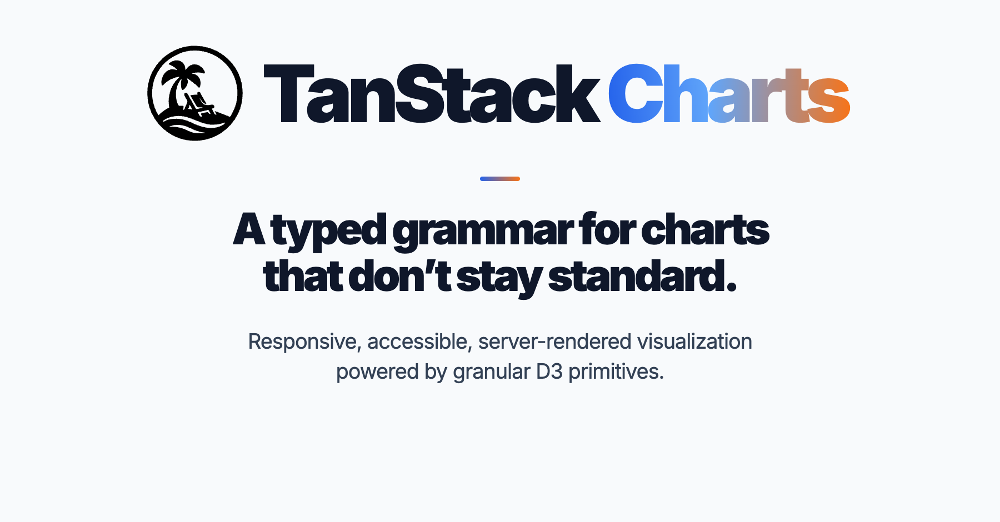

<div align="center">
  
</div>

<br />

<div align="center">
  <a href="https://github.com/TanStack/charts/actions/workflows/chart-library-benchmarks.yml">
    
  </a>
  <a href="https://github.com/TanStack/charts/stargazers">
    
  </a>
  <a href="./LICENSE">
    
  </a>
</div>

<div align="center">
  <a href="#status">
    
  </a>
  <a href="https://twitter.com/tan_stack">
    
  </a>
</div>

<div align="center">

### [Become a Sponsor!](https://github.com/sponsors/tannerlinsley/)

</div>

# TanStack Charts

A TypeScript visualization grammar for responsive, accessible,
server-rendered application charts.

<a id="status"></a>

> [!IMPORTANT]
> TanStack Charts `0.1.0` is pre-alpha. Its API may change between releases,
> and it is not ready for production use.

Most chart libraries are easy until the chart stops being standard. TanStack
Charts gives you one typed grammar that can grow from a familiar line or bar
chart into a product-specific visualization without replacing your data model
or dropping down to a separate API.

- **Keep your data as it is.** Marks consume arrays, objects, tuples, and
  iterables directly. Different layers can use different datum types.
- **Bring native D3 primitives.** Use D3 scales, curves, transforms, and layout
  output instead of relearning a parallel math API.
- **Build from common to custom.** Layer built-in marks or implement a custom
  mark against the same public scene protocol.
- **Get the application runtime too.** Responsive layout, automatic guide
  margins, themes, interaction, animation, accessibility, SVG SSR, opt-in
  Canvas painting, hydration, and export are part of the system.
- **Pay for what you import.** Marks, renderers, and chart-owned interactions
  have independent TanStack subpaths; specialized algorithms come directly
  from granular, tree-shakeable `d3-*` packages.

### <a href="https://tanstack.com/charts">Read the docs →</a>

## Quick look

<!-- docs-example: root-readme-quick-look typecheck -->

```tsx
import { scaleBand, scaleLinear } from 'd3-scale'
import { barY, defineChart } from '@tanstack/charts'
import { tooltip } from '@tanstack/charts/tooltip'
import { Chart } from '@tanstack/react-charts'

const revenue = [
  { month: 'Jan', value: 42 },
  { month: 'Feb', value: 58 },
  { month: 'Mar', value: 76 },
  { month: 'Apr', value: 64 },
]

const revenueChart = defineChart({
  marks: [
    barY(revenue, {
      x: 'month',
      y: 'value',
    }),
  ],
  x: {
    scale: () => scaleBand().padding(0.2),
  },
  y: {
    scale: scaleLinear,
    nice: true,
    grid: true,
    axis: { label: 'Revenue' },
  },
  tooltip,
})

export function RevenueChart() {
  return (
    <Chart definition={revenueChart} height={320} ariaLabel="Monthly revenue" />
  )
}
```

Marks consume the original rows, channels describe their visual encodings, and
D3 scale factories infer domains from those channels. A configured scale
instance keeps its authored domain. TanStack assigns responsive pixel ranges,
compiles a renderer-neutral keyed scene, and hands that scene to the selected
host.

Definitions are framework-independent. The same `revenueChart` can render
through React, Preact, Vue, Solid, Svelte, Angular, Lit, Alpine, Octane, the
vanilla DOM host, static SVG, or the optional Canvas renderer.

When SVG element count becomes the bottleneck, switch the adapter import and
keep the definition and host callbacks:

```tsx
import { Chart } from '@tanstack/react-charts/canvas'
```

Canvas stays outside the default bundles. React and Octane also expose a
renderer-neutral `/core` entry when an application owns the surface. Canvas
removes per-mark DOM cost, not scene memory or dense nearest-point work, so
large interactive charts should still use a measured spatial index or a
bounded representation.

## Packages

| Package                                                 | Role                                  |
| ------------------------------------------------------- | ------------------------------------- |
| [`@tanstack/charts`](./packages/charts-core)            | Framework-neutral grammar and runtime |
| [`@tanstack/react-charts`](./packages/react-charts)     | React adapter                         |
| [`@tanstack/preact-charts`](./packages/preact-charts)   | Preact adapter                        |
| [`@tanstack/vue-charts`](./packages/vue-charts)         | Vue adapter                           |
| [`@tanstack/solid-charts`](./packages/solid-charts)     | Solid adapter                         |
| [`@tanstack/svelte-charts`](./packages/svelte-charts)   | Svelte adapter                        |
| [`@tanstack/angular-charts`](./packages/angular-charts) | Angular standalone-component adapter  |
| [`@tanstack/lit-charts`](./packages/lit-charts)         | Lit custom-element adapter            |
| [`@tanstack/alpine-charts`](./packages/alpine-charts)   | Alpine directive adapter              |
| [`@tanstack/octane-charts`](./packages/octane-charts)   | Octane adapter                        |

The earlier host experiment remains under `@plot-poc/*` for migration evidence
and benchmark comparison. The private
[`@tanstack/charts-d3`](./packages/charts-core-d3) package preserves a
superseded backend experiment.

## Core model

TanStack Charts deliberately splits ownership:

| D3 owns                                                      | TanStack Charts owns                                                                          |
| ------------------------------------------------------------ | --------------------------------------------------------------------------------------------- |
| Scales, shapes, transforms, color, spatial math, and layouts | Marks, channels, responsive ranges, guide layout, scene compilation, rendering, and lifecycle |

This boundary keeps D3 visible and replaceable at the algorithm level while
giving applications a consistent runtime. There is no global registry,
library-owned dataframe, or chart-type configuration model.

## Lineage

TanStack Charts is an independent implementation. Its conceptual lineage and
the projects and people whose work informed it are credited in
[`ACKNOWLEDGEMENTS.md`](./ACKNOWLEDGEMENTS.md).

## Built almost entirely with AI

I designed TanStack Charts and directed its architecture, API, tradeoffs, and
final decisions. Almost all of the implementation was produced with AI coding
agents under my direct supervision, then reviewed and accepted into the
project.

For live application state, memoize the complete `defineChart(...)` result with
the framework's native memoization primitive. Definition identity is the
application update boundary, while responsive definition callbacks still
receive the current chart size and theme. The definition drives host prop and
callback inference, so normal authoring does not require adapter generics,
mark-array annotations, or casts. See
[Chart Definitions](./docs/concepts/chart-definitions.md) for the complete
pattern.

## Documentation

| Start here                                                                       | Use it for                                               |
| -------------------------------------------------------------------------------- | -------------------------------------------------------- |
| [`docs/overview.md`](./docs/overview.md)                                         | Product model, responsibilities, and defaults            |
| [`docs/comparison.md`](./docs/comparison.md)                                     | Pinned capability and bundle comparison                  |
| [`docs/quick-start.md`](./docs/quick-start.md)                                   | First complete framework-agnostic chart                  |
| [`docs/concepts/grammar-of-graphics.md`](./docs/concepts/grammar-of-graphics.md) | Marks, channels, scales, and composition                 |
| [`docs/concepts/scales-and-d3.md`](./docs/concepts/scales-and-d3.md)             | The D3 dependency and ownership boundary                 |
| [`docs/examples/index.md`](./docs/examples/index.md)                             | Curated chart-family and interaction examples            |
| [`docs/guides/ai-authoring.md`](./docs/guides/ai-authoring.md)                   | Deterministic authoring and validation for coding agents |
| [`docs/reference/index.md`](./docs/reference/index.md)                           | Complete public API map                                  |
| [`llms.txt`](./llms.txt)                                                         | Generated documentation routing index                    |

Architecture decisions and open production gates live in
[`PLAN.md`](./PLAN.md). Evidence from real authoring and migration work is
tracked in [`API-FRICTION.md`](./API-FRICTION.md).

## Get Involved

- We welcome issues and pull requests.
- Chat with the community on [Discord](https://discord.com/invite/WrRKjPJ).
- Follow the project through the [roadmap](./PLAN.md) and
  [conformance catalog](./benchmarks/conformance).

## Partners

<table align="center">
  <tr>
    <td>
      <a href="https://www.coderabbit.ai/?via=tanstack&dub_id=aCcEEdAOqqutX6OS">
        <picture>
          <source media="(prefers-color-scheme: dark)" srcset="https://raw.githubusercontent.com/TanStack/tanstack.com/main/src/images/coderabbit-dark.svg" />
          <source media="(prefers-color-scheme: light)" srcset="https://raw.githubusercontent.com/TanStack/tanstack.com/main/src/images/coderabbit-light.svg" />
          
        </picture>
      </a>
    </td>
    <td>
      <a href="https://www.cloudflare.com?utm_source=tanstack">
        <picture>
          <source media="(prefers-color-scheme: dark)" srcset="https://raw.githubusercontent.com/TanStack/tanstack.com/main/src/images/cloudflare-white.svg" />
          <source media="(prefers-color-scheme: light)" srcset="https://raw.githubusercontent.com/TanStack/tanstack.com/main/src/images/cloudflare-black.svg" />
          
        </picture>
      </a>
    </td>
  </tr>
</table>

<div align="center">
  
  <p>
    We're looking for TanStack Charts Partners to join our mission! Partner
    with us to push the boundaries of TanStack Charts and build amazing things
    together.
  </p>
  <a href="mailto:partners@tanstack.com?subject=TanStack Charts Partnership"><b>LET'S CHAT</b></a>
</div>

## Explore the TanStack Ecosystem

- <a href="https://github.com/tanstack/config"><b>TanStack Config</b></a> –
  Tooling for JS/TS packages
- <a href="https://github.com/tanstack/db"><b>TanStack DB</b></a> – Reactive
  sync client store
- <a href="https://github.com/tanstack/devtools"><b>TanStack DevTools</b></a> –
  Unified devtools panel
- <a href="https://github.com/tanstack/form"><b>TanStack Form</b></a> –
  Type-safe form state
- <a href="https://github.com/tanstack/pacer"><b>TanStack Pacer</b></a> –
  Debouncing, throttling, and batching
- <a href="https://github.com/tanstack/query"><b>TanStack Query</b></a> – Async
  state and caching
- <a href="https://github.com/tanstack/ranger"><b>TanStack Ranger</b></a> –
  Range and slider primitives
- <a href="https://github.com/tanstack/router"><b>TanStack Router</b></a> –
  Type-safe routing, caching, and URL state
- <a href="https://github.com/tanstack/router"><b>TanStack Start</b></a> –
  Full-stack SSR and streaming
- <a href="https://github.com/tanstack/store"><b>TanStack Store</b></a> –
  Reactive data store
- <a href="https://github.com/tanstack/table"><b>TanStack Table</b></a> –
  Headless datagrids
- <a href="https://github.com/tanstack/virtual"><b>TanStack Virtual</b></a> –
  Virtualized rendering

… and more at <a href="https://tanstack.com"><b>TanStack.com »</b></a>

## Development

The workspace requires Node.js 22 or newer and pnpm 11. Use the version in
`.nvmrc`. See [Contributing](./CONTRIBUTING.md) for the Nx CI graph, changeset
requirements, and automated OIDC release flow.

```sh
pnpm install
pnpm run validate
pnpm test
pnpm typecheck
pnpm build
pnpm package:check
```

Run a local example:

```sh
pnpm dev:charts-react
pnpm dev:charts-octane
pnpm dev:sandbox
pnpm dev:conformance
```

The repository includes three complementary benchmark suites:

- [`benchmarks/bundle-size`](./benchmarks/bundle-size) locks ordinary consumer
  bundles and isolates optional feature costs.
- [`benchmarks/comparison`](./benchmarks/comparison) compares equivalent line,
  bar, area, and scatter consumers across chart libraries, including a
  [large-data and update stress matrix](./benchmarks/comparison/stress).
- [`benchmarks/conformance`](./benchmarks/conformance) exercises a broad,
  typed catalog against multiple reference renderers.

```sh
pnpm bundle:check
pnpm performance
pnpm benchmark:check
pnpm benchmark:stress:quick
pnpm conformance:quick
```

These measurements are development evidence, not release claims. See each
suite's README for its protocol, output, and limitations.

Pull requests gate formatting, types, tests, packed exports and declarations,
locked bundles, comparison bundles, catalog metadata, browser comparison, and
the quick five-library stress matrix. Conformance is monitored separately with
a rotating nightly shard, a complete weekly matrix, manual runs, and an
opt-in `full-conformance` pull-request label.

## License

[MIT](./LICENSE) © Tanner Linsley. See
[`ACKNOWLEDGEMENTS.md`](./ACKNOWLEDGEMENTS.md) for project lineage.
